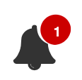

# Notifications Component

This project showcases an example of how to build a *Reusable Notifications Icon* using *Kony Visualizer*.

## Use Cases

Pick an icon from the FontAwesome icon font and display a bubble with a notification counter atop right.

